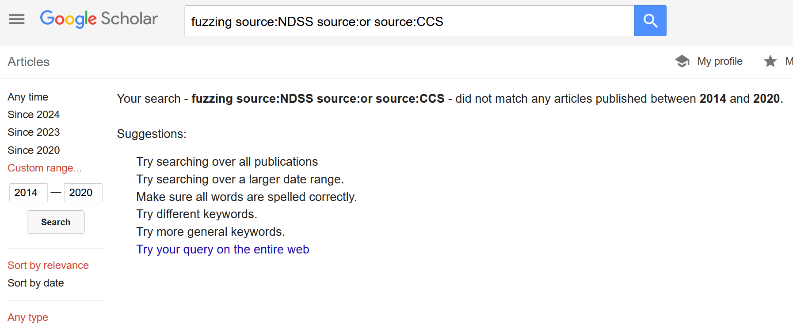

# cspapers.org

An index for computer science papers.

## How to add papers

If you would like to add some papers, please add them in `data/` and make a PR. Once it is merged, CD/CI will reindex and distribute automatically.

## How to run local

Install dependencies
```bash
npm install
```

Build and run

```bash
# generate index db
go run api.cspapers.org/index -debug
# run server
go run api.cspapers.org/server -debug
# run web
npm run start
```

or

```
docker build -t server .
docker run -it server
npm run start
```

try: http://localhost:8000/?query=fuzzing&yearFrom=2014&yearTo=2024&skip=0&take=20

## Why not Google scholar

Poor conference filter:



¯\\_(ツ)_/¯

## Todo

* Pagination
* Add more papers

PR is welcome

## Acknowlegement

Refered csrankings.org for organizing conferences.

## Disclaimer

cspapers.org is served as implemented in this repository. I do not modify source code or data in and after distributions.  
As shown in the source code, cspapers.org does not collect user data, such as search history and IP address. However, Cloudflare and fly.io do this for pricing and security purpose.  
I personally own stock (less than \$10k) of Cloudflare and I hope they will be profited so I can be rich. This is why I buy a domain name from Cloudflare - that will add ~10$ per year to net sales.  
cspapers.org uses fly.io because it is the cheapest server. It costs ~2$ per month with 1 core and 256MB RAM. I am always willing to migrate to a cheaper one. Suggestion is welcome.  
Each conference site provides origins of titles and abstracts of papers.
